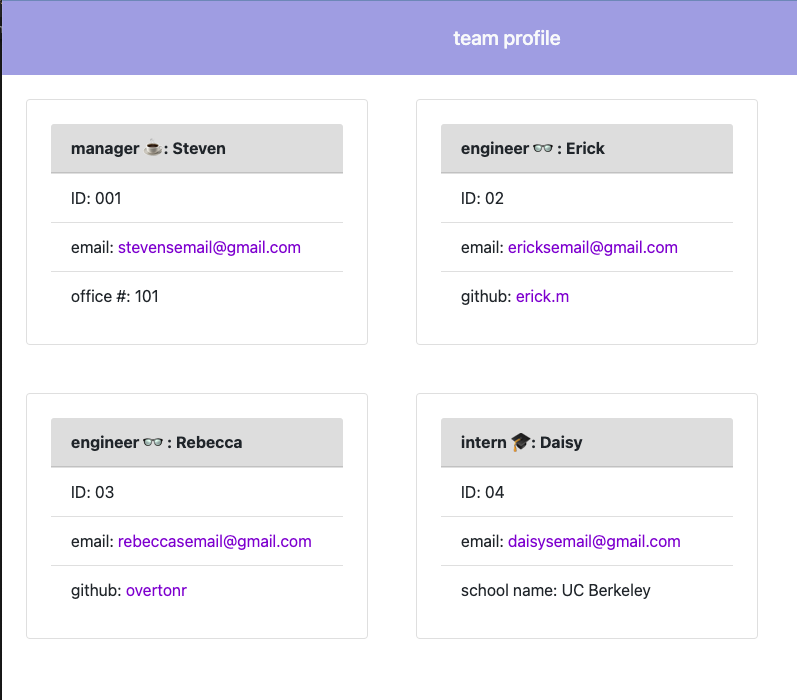

# Team Profile Generator

## Description
This is a Node.js command-line application that takes in information about employees on a team, then generates an HTML webpage that displays a profile card for each person. 

[](https://opensource.org/licenses/MIT)


## Table of Contents
---
- [Installation](#installation)
- [Usage](#usage)
- [License](#license)
- [Contributing](#contributing)
- [Questions](#questions)
## Installation
- Node.js
- Inquirer NPM Package
- Jest NPM Package

## Usage
Users should start by navigating to the file. Once in the current directory in the terminal, users will enter
```
npm index.js
```
to start the application. They should then follow each promp from the command line. Once they finish the initial manager profile, they will be asked to select from a list of menu choices which includes either create an engineer profile, create an intern profile, or to stop constructing the profile which calls for the HTML to be generated. 

The menu options, generated using inquirer, will appear every time an engineer or intern profile is completed.
```
{
type:"list",
name: "menu",
message:"Would you like to add an engineer, add an intern, or finish building the team?",
choices: ["Add an engineer","Add an intern", "Finish building team"]
}
```

Once completed, cards will populate that contain each members profile information.



Users can also click on the email link to open up their system's default email program with the email already populated in the recipients field. The github username for each engineer will serve as a link to their github profile and will open this link in a new tab.

## License
This application is covered under the MIT license.

## Contributing
None


## Questions
https://github.com/overtonr
